# 2. Diseño de la arquitectura (UML)

Todos los diagramas están en [`diagramas/`](diagramas/) en tres formatos: fuente Mermaid
(`.mmd`, editable y versionable), `svg/` (vectorial, para el informe) y `png/` (para las
diapositivas). Se generan con `mermaid-cli`, de modo que **el diagrama es código**: si cambia
la arquitectura, cambia el `.mmd` y se regenera la imagen. Nunca queda desactualizado en un
PowerPoint olvidado.

---

## 2.1 Estilo arquitectónico elegido

**Microservicios orientados a eventos**, con base de datos por servicio y comunicación mixta:
síncrona (HTTP/REST) para lo que el usuario espera en pantalla, asíncrona (mensajes) para todo
lo demás.

### Por qué no un monolito modular

Un monolito bien modularizado habría sido más simple de operar y más barato, y para muchos
sistemas es la respuesta correcta (Fowler, 2015, advierte explícitamente contra empezar por
microservicios). Se descartó por **una razón concreta del caso**: el requisito RNF-03 exige
escalar de 200 a 100 000 usuarios en 60 segundos, pero **solo en la ruta de venta**. En un
monolito hay que replicar *todo* el sistema —reportería, administración, catálogo— para
absorber un pico que afecta a un 20 % del código. Eso multiplica el costo por cinco y choca
con la restricción RB-1.

A eso se suma el requisito RNF-11: desplegar el catálogo sin detener la venta. En un monolito,
todo despliegue es un despliegue de todo.

### Por qué no serverless puro

Se evaluaron funciones como servicio (Lambda / Azure Functions). Encajan muy bien con el perfil
de picos y con RB-2. Se descartaron por dos motivos: el **arranque en frío** amenaza el RNF-02
justo en el minuto del *onsale*, que es cuando más importa; y la saga de compra mantiene estado
entre pasos, lo que en serverless obliga a un orquestador externo (Step Functions, Durable
Functions) que ata el diseño a un proveedor y viola RNF-16. Sí se recomiendan para tareas
periféricas (generación de PDF de boletas, reportes nocturnos).

### División en servicios

Los límites **no** se trazaron por capas técnicas, sino por **capacidad de negocio**, siguiendo
Domain-Driven Design (Evans, 2003; Newman, 2021):

| Servicio | Capacidad de negocio | Razón para que sea autónomo |
|---|---|---|
| **Catálogo** | Qué se vende | 95 % lecturas; escala y cachea distinto a todo lo demás |
| **Reservas** | Quién compra qué | Núcleo transaccional; la consistencia manda sobre la velocidad |
| **Pagos** | Cobrar y devolver | Aislamiento por cumplimiento PCI-DSS y por ser el más frágil |
| **Notificaciones** | Avisar al comprador | Puramente asíncrono; nunca debe bloquear una venta |
| **Broker** | Transporte de eventos | Infraestructura; en producción es un servicio gestionado |
| **Gateway** | Puerta de entrada | Concentra lo transversal; es el único expuesto a Internet |

---

## 2.2 Diagrama de casos de uso

**Qué muestra.** Los tres actores primarios (comprador, administrador de catálogo, operador),
la frontera del sistema y los actores secundarios: dos sistemas externos y un actor temporal.

**Por qué es relevante para la arquitectura.** No es un adorno: **tres decisiones de diseño
salen directamente de este diagrama**.

1. *Procesar pago* y *Notificar al comprador* tocan la frontera hacia sistemas externos que la
   empresa no controla. Todo lo que cruza esa línea necesita cortacircuitos, reintento y
   tiempo límite. El diagrama hace visible dónde está el riesgo.
2. *Comprar boletas* incluye tres casos de uso y **extiende** a *Compensar compra fallida*. Esa
   relación `extend` es la traducción en UML de que la compra es una transacción distribuida
   con rollback lógico: justifica la saga.
3. El **reloj del sistema** aparece como actor porque *Liberar cupo por expiración* no lo
   dispara ninguna persona. Un caso de uso sin actor humano exige un proceso en segundo plano,
   que es el barredor implementado en el servicio de reservas.

---

## 2.3 Diagrama de clases

**Qué muestra.** Las clases que materializan un patrón o una regla de negocio. Se omiten
deliberadamente los objetos de transferencia y los ayudantes triviales: un diagrama de clases
que lo dibuja todo no comunica nada.

**Cómo leerlo.** Se organiza en cuatro bloques:

- **Dominio:** `Reserva`, `LineaDeInventario` y `OrquestadorDeSaga`. Nótese que
  `LineaDeInventario` tiene un atributo `version`: no es un detalle de persistencia, es **el
  mecanismo que impide la sobreventa** y por eso aparece en el modelo.
- **Strategy** (tarifas) y **Adapter** (pasarelas): dos jerarquías de herencia con la misma
  forma pero propósito distinto. Strategy intercambia *algoritmos propios*; Adapter traduce
  *interfaces ajenas*.
- **Observer** (notificaciones): `DespachadorDeNotificaciones` agrega canales; la agregación
  (rombo hueco) indica que los canales existen independientemente del despachador.
- **Infraestructura compartida:** `ClienteServicio` **compone** (rombo lleno) su cortacircuitos
  y su mamparo, porque no tienen vida fuera de él.

**Por qué es relevante.** El diagrama demuestra el **principio abierto/cerrado** de forma
verificable: agregar una cuarta pasarela o una quinta política de tarifa **añade una hoja al
árbol de herencia y no modifica ninguna clase existente**. Ese es exactamente el requisito
RNF-12.

---

## 2.4 Diagrama de secuencia — compra exitosa

**Qué muestra.** La saga completa de una compra: los cuatro pasos, dónde actúa cada patrón y —
lo más importante— **dónde termina la espera del usuario**.

**Por qué es relevante.**

- Los recuadros de color separan los pasos de la saga. Cada uno es una transacción local
  independiente; entre ellos **no hay transacción ACID**, y esa es la razón de existir de la
  compensación.
- Las flechas abiertas hacia el broker (pasos 8 y 15) son asíncronas. La respuesta al comprador
  sale en el paso 17; los pasos 18 a 23 ocurren **después**. Ahí se ve el cumplimiento del
  RNF-02: el correo no está en el camino crítico.
- La cabecera `idempotency-key` viaja del cliente al gateway, del gateway a reservas, y reservas
  genera **su propia clave** hacia pagos (`cobro-RES-123`). Son dos niveles de idempotencia
  distintos: uno protege contra el reintento del usuario, el otro contra el reintento del
  embajador.

---

## 2.5 Diagrama de secuencia — fallo, compensación y cortacircuitos

**Qué muestra.** El mismo flujo cuando la pasarela falla, y qué cambia a partir del quinto
comprador.

**Por qué es relevante.** Es el diagrama que justifica la mitad de las decisiones del proyecto:

- Los tres intentos con espera creciente son el patrón **Retry**. Absorben el fallo transitorio.
- Cuando el fallo es persistente, el **cortacircuitos** se abre y el siguiente comprador recibe
  su respuesta en **milisegundos en lugar de segundos**. Sin él, cada usuario esperaría tres
  tiempos límite antes de un error: el sistema se degradaría hasta caer por agotamiento de
  hilos, que es exactamente el fallo en cascada de noviembre de 2025 del caso.
- La compensación deja el inventario **idéntico**. La medición está en la prueba de integración
  *«Compensación: si el pago falla, el cupo vuelve al inventario»*.

---

## 2.6 Diagrama de despliegue

**Qué muestra.** Los nodos físicos y lógicos: borde (CDN + WAF), subred pública (balanceador),
subred privada (contenedores), subred de datos (sin salida a Internet) y observabilidad.

**Por qué es relevante.**

- **Rangos de réplicas distintos por servicio.** Catálogo escala de 3 a 20; reservas de 3 a 30;
  notificaciones de 2 a 50 y **por longitud de cola**, no por CPU, porque su cuello de botella
  es el trabajo pendiente. Esta heterogeneidad es la justificación económica de los
  microservicios (RB-1, RB-2).
- **Una base de datos por servicio.** No hay ninguna flecha de un servicio a la base de otro.
  Si la hubiera, el diagrama estaría delatando un monolito distribuido.
- **La subred de datos no tiene salida a Internet** y la de pagos está cifrada en reposo:
  requisitos RT-4 y RNF-15.
- **Solo el gateway está expuesto.** Reduce la superficie de ataque a un único punto donde se
  concentran WAF, TLS, autenticación y límite de tasa.

---

## 2.7 Diagrama de componentes

Mapa de **qué patrón vive en qué servicio**. Es el diagrama de referencia para la sección 3 y
el que conviene tener en pantalla durante la sustentación: permite señalar cualquier patrón y
decir en qué archivo del repositorio está.

---

## 2.8 Diagrama de estados — ciclo de vida de la reserva

**Qué muestra.** Los cinco estados posibles de una reserva y las transiciones.

**Por qué es relevante.** Cada transición hacia un estado terminal que **no** es `CONFIRMADA`
lleva asociada una compensación explícita. El diagrama es, en la práctica, la especificación de
la saga: si alguien agrega un estado nuevo, este diagrama obliga a preguntarse *«¿y qué hay que
deshacer?»*. También deja claro que solo desde `CONFIRMADA` se puede reembolsar, lo que en el
código es una validación de HTTP 409.

---

## 2.9 Trazabilidad diagrama → código

| Diagrama | Se materializa en |
|---|---|
| Casos de uso | Rutas del gateway ([`services/gateway/index.js`](../prototipo/services/gateway/index.js)) |
| Clases | [`services/reservas/tarifas.js`](../prototipo/services/reservas/tarifas.js), [`services/pagos/pasarelas.js`](../prototipo/services/pagos/pasarelas.js), [`lib/cliente-servicio.js`](../prototipo/lib/cliente-servicio.js) |
| Secuencia de compra | `ejecutarSagaDeCompra()` en [`services/reservas/index.js`](../prototipo/services/reservas/index.js) |
| Secuencia de compensación | Bloque `catch` de la misma función + [`lib/resiliencia.js`](../prototipo/lib/resiliencia.js) |
| Despliegue | [`docker-compose.yml`](../prototipo/docker-compose.yml) y [`render.yaml`](../render.yaml) |
| Componentes | Estructura de [`services/`](../prototipo/services/) |
| Estados | Constante `ESTADOS` y transiciones en el servicio de reservas |

---

**Anterior:** [1. Análisis de requisitos](01-analisis-requisitos.md) ·
**Siguiente:** [3. Patrones de diseño](03-patrones-de-diseno.md)
