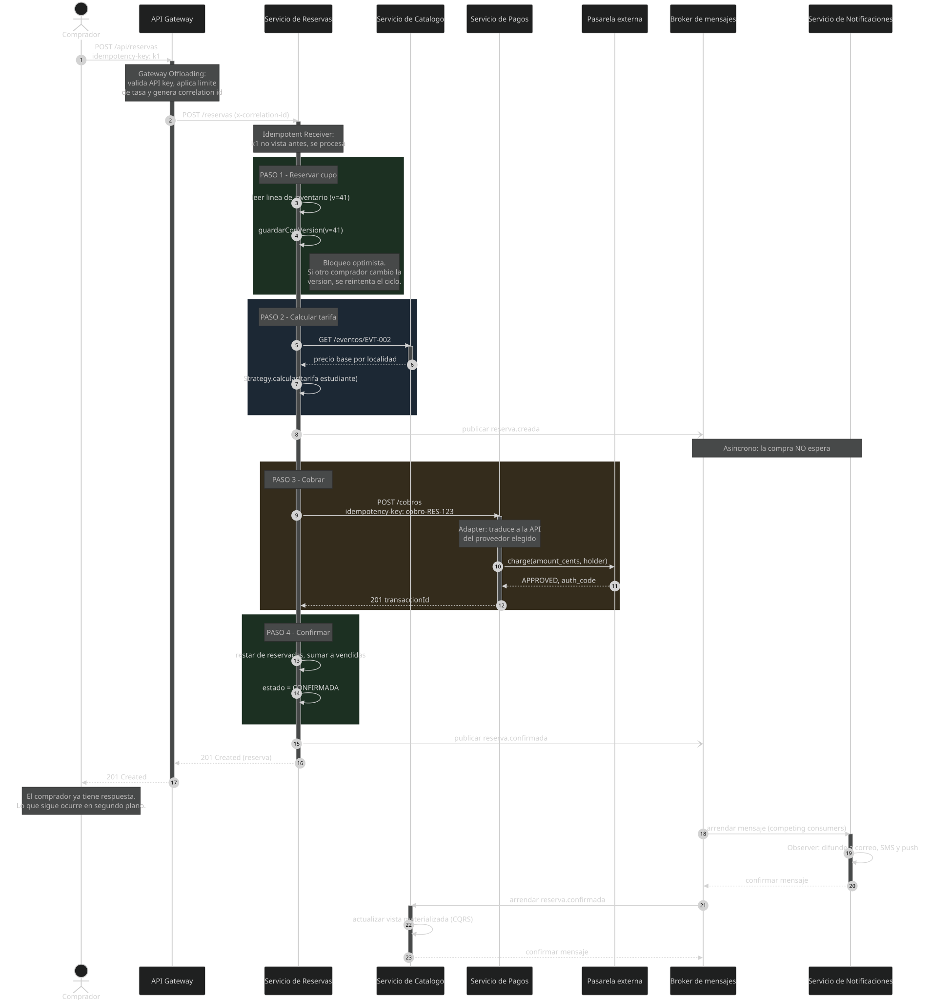
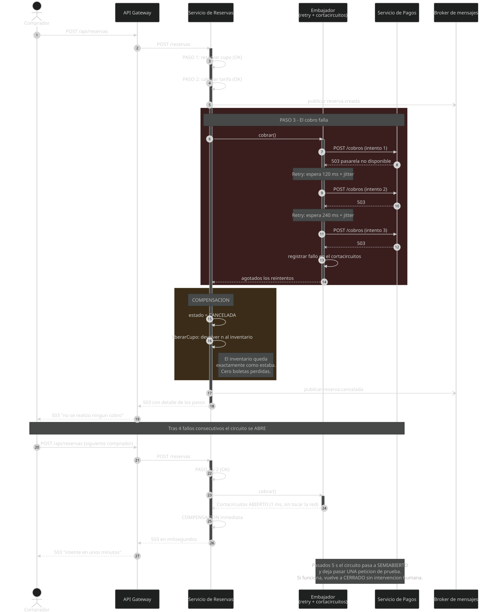

<div align="center">

# Orquestando códigos: la sinfonía de los sistemas

## Diseño e implementación de una arquitectura de microservicios en la nube para una plataforma de boletería

### Caso de estudio: Armonía S.A.S.

<br>

**Informe técnico**

<br>

**Juan Esteban Vélez Venegas**

<br>

Arquitectura de Software
Unidad 1 — Principios de arquitectura de software
Actividad 2 — Aprendizaje Basado en Proyectos

<br>

28 de agosto de 2026

<br>

**Repositorio del prototipo:** https://github.com/ingjvelez17/armonia-arquitectura
**Video de sustentación:** `<URL de YouTube, no listado>`

</div>

<div style="page-break-after: always;"></div>

## Resumen ejecutivo

Este informe documenta el diseño y la implementación de una arquitectura de microservicios
orientada a eventos para **Armonía S.A.S.**, una empresa colombiana de boletería cuyo monolito
actual no soporta el perfil de carga de su negocio: pasar de 200 a 100 000 usuarios
concurrentes en menos de sesenta segundos cuando se abre la venta de un artista importante.

Se analizaron **13 requisitos funcionales y 16 no funcionales** derivados de cinco incidentes
reales del caso, se diseñó la arquitectura con **siete diagramas UML**, se seleccionaron y
justificaron **30 patrones de diseño** —de nube, de mensajería y clásicos— y se construyó un
**prototipo funcional de seis microservicios** con 41 pruebas automatizadas.

Los resultados medidos verifican nueve de los once requisitos no funcionales comprobables en un
entorno de prototipo. Los tres más significativos:

- **Sobreventa cero.** Con 20 compradores simultáneos y 4 boletas disponibles se vendieron
  exactamente 4. El bloqueo optimista resolvió 1 044 conflictos de concurrencia durante la
  prueba de carga sin producir una sola inconsistencia.
- **Fallo rápido.** Con la pasarela de pago caída, el tiempo de respuesta pasó de **711 ms a
  1 ms** en cuanto el cortacircuitos se abrió, y el sistema se recuperó solo al restablecerse.
- **Cero cobros duplicados.** El receptor idempotente devuelve la reserva original ante
  reintentos, en dos niveles distintos de la cadena.

El informe documenta también lo que **no** funcionó: la primera implementación del control de
concurrencia usaba espera exponencial y producía hasta un 92 % de errores bajo carga. El
diagnóstico de esa falla —y su corrección— es uno de los aportes de este trabajo.

## Contenido

1. [Introducción](#1-introducción)
2. [Caso de estudio](#2-caso-de-estudio)
3. [Análisis de requisitos](#3-análisis-de-requisitos)
4. [Diseño de la arquitectura (UML)](#4-diseño-de-la-arquitectura-uml)
5. [Selección y justificación de patrones de diseño](#5-selección-y-justificación-de-patrones-de-diseño)
6. [Implementación del prototipo](#6-implementación-del-prototipo)
7. [Verificación y resultados](#7-verificación-y-resultados)
8. [Limitaciones y trabajo futuro](#8-limitaciones-y-trabajo-futuro)
9. [Conclusiones](#9-conclusiones)
10. [Referencias](#10-referencias)
11. [Anexos](#11-anexos)

<div style="page-break-after: always;"></div>

## 1. Introducción

### 1.1 Contexto

La arquitectura de software es el conjunto de decisiones que son difíciles de cambiar después
(Fowler, 2002). No es el diagrama que se dibuja al principio del proyecto, sino el conjunto de
estructuras que determinan qué atributos de calidad podrá alcanzar el sistema y cuáles le
quedarán vedados para siempre (Bass et al., 2021).

Esa definición importa aquí porque el problema de Armonía S.A.S. **no es de código**. Su
monolito funciona: vendió 1,8 millones de boletas en 2025. El problema es que su estructura
hace imposible escalar una parte sin escalar el todo, desplegar un módulo sin arriesgar los
demás, o aislar el fallo de un proveedor externo. Ningún refactor local resuelve eso; es una
limitación arquitectónica.

### 1.2 Objetivo

Diseñar e implementar una arquitectura modular, escalable y desplegable en la nube que resuelva
las cinco expectativas explícitas de la dirección de Armonía, aplicando análisis de requisitos,
modelado UML, patrones de diseño y prototipado funcional.

### 1.3 Alcance

El prototipo cubre el **flujo crítico de venta**: consultar catálogo, comprar boletas, pagar y
notificar. Se eligió ese recorte porque en él se concentran todas las fuerzas arquitectónicas
del caso (picos de demanda, transacción distribuida, dependencias externas falibles,
consistencia bajo concurrencia). Quedan fuera el control de acceso en recinto, la liquidación
con promotores y la reportería financiera.

### 1.4 Metodología

El trabajo siguió cinco fases encadenadas, cada una alimentando a la siguiente:

**(1) Análisis** mediante análisis de incidentes, historias de usuario (Cohn, 2004) y
escenarios de calidad ATAM → 13 RF y 16 RNF. **(2) Diseño** con UML 2.5.1 (OMG, 2017) y
registros de decisión → 7 diagramas y 6 ADR. **(3) Selección de patrones** a partir de los
catálogos de Microsoft (2024), Richardson (2018), Hohpe y Woolf (2003) y Gamma et al. (1994)
→ 30 patrones justificados. **(4) Implementación** guiada por los requisitos verificables →
6 microservicios. **(5) Verificación** con pruebas unitarias, de integración, de carga y de
caos → 41 pruebas y 4 escenarios.

**Nota sobre el trabajo en equipo.** La guía prevé equipos de 4 a 5 personas. Este trabajo se
desarrolló de forma individual por circunstancias de fuerza mayor; se conservó íntegramente el
alcance exigido y todos los roles del proyecto fueron asumidos por el autor.

### 1.5 Nota metodológica sobre el caso de estudio

La guía indica que el caso lo entrega el docente. Al no disponer de ese documento, se construyó
un caso que respeta literalmente las restricciones del enunciado —empresa ficticia que busca
mejorar su infraestructura tecnológica, con exigencia de modularidad, escalabilidad y despliegue
en la nube—. **Si el enunciado oficial describe otra empresa, el análisis, los diagramas y los
patrones se sostienen igual**, porque las fuerzas arquitectónicas (picos de demanda,
transacciones distribuidas, dependencias poco confiables) son las mismas.

## 2. Caso de estudio

### 2.1 La empresa

**Armonía S.A.S.**, fundada en Medellín en 2016, comercializa boletería para conciertos y
festivales en Bogotá, Medellín, Cali y Barranquilla. En 2025 vendió 1,8 millones de boletas para
340 eventos. Su plataforma es un monolito PHP con una única base de datos MySQL, en dos
servidores físicos.

### 2.2 El problema

El negocio de la boletería tiene una característica arquitectónicamente excepcional: **la
demanda no es una curva, es un pico**. Al abrir la venta de un artista importante —el
*onsale*— la plataforma pasa de 200 a más de 90 000 usuarios concurrentes en menos de sesenta
segundos, sostiene esa carga entre 10 y 20 minutos, y vuelve a la línea base. El resto del mes
está prácticamente ociosa.

Cinco incidentes en 18 meses, con la misma raíz:

| Fecha | Incidente | Impacto |
|---|---|---|
| Mar 2025 | Caída total de 47 min durante un *onsale* | 1 900 M COP en ventas perdidas |
| Jun 2025 | Doble cobro a 3 200 clientes por reintentos | 340 M COP + sanción de la SIC |
| Ago 2025 | Sobreventa de 180 boletas en localidad numerada | Reubicaciones y daño reputacional |
| Nov 2025 | La caída del proveedor de correo arrastró la venta | 6 h sin operar |
| Ene 2026 | Un despliegue de reportería tumbó la venta | 2 h sin operar |

La raíz común es **el acoplamiento**: todo está unido a todo. Los cinco incidentes son síntomas
de una sola causa estructural, y por eso la solución tenía que ser arquitectónica.

### 2.3 Restricciones y expectativas

**De negocio:** presupuesto ≤ 8 000 USD/mes (RB-1); el costo debe subir y **bajar** con la
demanda (RB-2); migración incremental, sin apagar el monolito (RB-3); cumplimiento de la Ley
1581 de 2012 y PCI-DSS (RB-4); equipo de 9 desarrolladores, sin equipo de plataforma dedicado
(RB-5).

**Técnicas:** nube pública con contenedores (RT-1); tres medios de pago obligatorios —tarjeta,
PSE y billeteras digitales—, ninguno confiable al 100 % (RT-2); integración con 14 recintos
(RT-3); prohibido almacenar datos de tarjeta (RT-4).

**Expectativas de la dirección:** que un *onsale* de 100 000 personas no tumbe la plataforma;
que nunca se venda una boleta inexistente ni se cobre dos veces; que la caída de un proveedor
**degrade** el servicio en lugar de apagarlo; que se pueda desplegar el catálogo sin detener la
venta; y que un incidente se diagnostique en minutos.

## 3. Análisis de requisitos

### 3.1 Técnica aplicada

Los requisitos no se listaron por intuición. Cada uno de los cinco incidentes se convirtió en
una pregunta: *¿qué requisito, de haber existido, lo habría evitado?* Esa derivación produce
requisitos con justificación verificable. Se complementó con historias de usuario (Cohn, 2004)
y con **escenarios de atributos de calidad** en el formato ATAM del SEI (Bass et al., 2021),
que es lo que convierte «el sistema debe ser rápido» —imposible de probar— en un número medible.

### 3.2 Actores

| Actor | Tipo | Rol |
|---|---|---|
| Comprador | Primario, humano | Consulta y compra boletas |
| Administrador de catálogo | Primario, humano | Publica eventos, define precios |
| Operador de plataforma | Primario, humano | Vigila la salud y responde incidentes |
| Pasarela de pago | Secundario, sistema | Tarjeta, PSE o billetera. Externo y falible |
| Proveedor de mensajería | Secundario, sistema | Correo, SMS, push |
| Reloj del sistema | Secundario, temporal | Dispara la expiración de reservas |

### 3.3 Requisitos funcionales (extracto)

Los 13 requisitos completos, con sus criterios de aceptación, están en
[`docs/01-analisis-requisitos.md`](../docs/01-analisis-requisitos.md). Los determinantes:

| ID | Requisito | Criterio de aceptación verificable |
|---|---|---|
| RF-01 | Consultar catálogo con filtro por ciudad | Responde en < 300 ms solo con eventos de esa ciudad |
| RF-03 | Consultar disponibilidad real | No difiere del inventario autoritativo en más de 2 s |
| RF-04 | Comprar de 1 a 6 boletas | Una petición de 7 se rechaza con HTTP 400 |
| RF-05 | Tarifas diferenciadas | Tarifa estudiante = 70 % del subtotal |
| RF-06 | Cobrar por tres medios de pago | Los tres devuelven la misma estructura interna |
| RF-07 | Liberar el cupo si el pago falla | El inventario antes y después es idéntico |
| RF-08 | Liberar reservas abandonadas | Pasan a EXPIRADA y devuelven el cupo |
| RF-11 | Reembolsar una compra confirmada | Se reversa el cobro y vuelve el cupo |
| RF-13 | Trazar cada operación | El identificador del cliente aparece en los 5 servicios |

### 3.4 Requisitos no funcionales

Escritos como escenarios de calidad medibles, clasificados según ISO/IEC 25010:2023.

| ID | Atributo | Escenario | Medida objetivo |
|---|---|---|---|
| RNF-01 | Rendimiento | Consulta de catálogo, operación normal | p95 < 300 ms |
| RNF-02 | Rendimiento | Compra completa, operación normal | p95 < 3 s |
| RNF-03 | Escalabilidad | 100 000 usuarios llegan en 60 s | Rechazo ≤ 5 % |
| RNF-04 | Escalabilidad | La demanda cae tras el pico | Reducción automática en < 10 min |
| RNF-05 | Disponibilidad | Operación mensual | ≥ 99,9 % |
| RNF-06 | Resiliencia | La pasarela deja de responder | Catálogo sigue; la compra falla en < 500 ms |
| RNF-07 | Resiliencia | El proveedor se recupera | Vuelve a usarse sin intervención en < 30 s |
| RNF-08 | Resiliencia | 40 % de fallos transitorios | ≥ 90 % de compras completadas |
| **RNF-09** | **Consistencia** | **20 compradores, 4 boletas** | **Se venden 4. Sobreventa = 0** |
| **RNF-10** | **Consistencia** | **N reintentos del mismo cliente** | **1 cobro y 1 reserva** |
| RNF-11 | Mantenibilidad | Despliegue del catálogo | La venta no se detiene |
| RNF-12 | Mantenibilidad | Cuarta pasarela de pago | Solo se agrega una clase adaptadora |
| RNF-13 | Observabilidad | Incidente en producción | La traza se reconstruye con un identificador |
| RNF-14 | Seguridad | Cliente abusivo | Se limita su tasa sin afectar a los demás |
| RNF-15 | Seguridad | Datos de tarjeta | Nunca se almacenan |
| RNF-16 | Portabilidad | Cambio de proveedor de nube | Ninguna dependencia de API propietaria |

### 3.5 De los requisitos a la arquitectura

Esta tabla es la bisagra del trabajo: **cada decisión responde a un requisito**, no a una moda.

| Requisito | Fuerza arquitectónica | Decisión |
|---|---|---|
| RNF-03, RNF-04, RNF-11 | Escalar y desplegar por partes | Microservicios con base de datos por servicio |
| RNF-01 | Lecturas masivas repetidas | Cache-Aside + CQRS con vista materializada |
| RNF-02 | Muchas llamadas desde el móvil | API Gateway con agregación (BFF) |
| RNF-06, RNF-07, RNF-08 | Dependencias externas falibles | Circuit Breaker + Retry + Timeout + Bulkhead |
| RNF-09 | Contención sobre el inventario | Bloqueo optimista con número de versión |
| RNF-10 | La red duplica peticiones | Receptor idempotente |
| RF-07, RF-11 | No hay transacción ACID distribuida | Saga orquestada con compensación |
| RNF-03, RF-09 | El pico no puede propagarse | Cola de nivelación + consumidores en competencia |
| RNF-12, RT-2 | Tres APIs externas distintas | Adapter + Strategy |
| RNF-14, RNF-15 | Superficie de ataque | Descarga transversal en el gateway |
| RNF-05, RNF-13 | Detección temprana | Sondas de salud + correlación distribuida |
| RNF-16 | Independencia de proveedor | Contenedores + configuración externalizada |
| RB-3 | Migración incremental | Strangler Fig sobre el monolito |

## 4. Diseño de la arquitectura (UML)

### 4.1 Estilo arquitectónico y su justificación

**Microservicios orientados a eventos**, con base de datos por servicio y comunicación mixta:
síncrona (HTTP/REST) para lo que el usuario espera en pantalla, asíncrona (mensajes) para todo
lo demás.

**Por qué no un monolito modular.** Habría sido más simple y más barato de operar, y para muchos
sistemas es la respuesta correcta; Fowler (2015) advierte explícitamente contra empezar por
microservicios. Se descartó por una razón concreta: RNF-03 exige escalar de 200 a 100 000
usuarios, **pero solo en la ruta de venta**. En un monolito hay que replicar *todo* —reportería,
administración, catálogo— para absorber un pico que afecta al 20 % del código. Eso multiplica el
costo por cinco y choca con RB-1. A eso se suma RNF-11: en un monolito, todo despliegue es un
despliegue de todo.

**Por qué no serverless puro.** Encaja bien con el perfil de picos y con RB-2, pero el arranque
en frío amenaza RNF-02 justo en el minuto del *onsale*, y la saga con estado obliga a un
orquestador propietario que viola RNF-16. Sí se recomienda para tareas periféricas (generación
de PDF de boletas, reportes nocturnos).

**División en servicios.** Los límites se trazaron por **capacidad de negocio**, no por capas
técnicas, siguiendo Domain-Driven Design (Evans, 2003; Newman, 2021):

| Servicio | Capacidad | Razón para ser autónomo |
|---|---|---|
| Catálogo | Qué se vende | 95 % lecturas; escala y cachea distinto |
| Reservas | Quién compra qué | Núcleo transaccional; la consistencia manda |
| Pagos | Cobrar y devolver | Aislamiento PCI-DSS; es el componente más frágil |
| Notificaciones | Avisar al comprador | Asíncrono; nunca debe bloquear una venta |
| Broker | Transporte de eventos | Infraestructura; en producción, servicio gestionado |
| Gateway | Puerta de entrada | Concentra lo transversal; único expuesto a Internet |

### 4.2 Diagrama de casos de uso



*Figura 1. Casos de uso. Actores primarios a la izquierda, frontera del sistema al centro,
actores secundarios a la derecha.*

**Relevancia arquitectónica.** Tres decisiones de diseño salen directamente de este diagrama.
Primero, *Procesar pago* y *Notificar al comprador* cruzan la frontera hacia sistemas que la
empresa **no controla**: todo lo que atraviesa esa línea necesita cortacircuitos, reintento y
tiempo límite. El diagrama hace visible dónde está el riesgo. Segundo, *Comprar boletas*
**extiende** a *Compensar compra fallida*: esa relación es la traducción en UML de que la compra
es una transacción distribuida con rollback lógico, y justifica la saga. Tercero, el **reloj del
sistema** aparece como actor porque *Liberar cupo por expiración* no lo dispara ninguna persona;
un caso de uso sin actor humano exige un proceso en segundo plano.

### 4.3 Diagrama de clases



*Figura 2. Clases que materializan un patrón o una regla de negocio.*

Se modelan solo las clases significativas: un diagrama que lo dibuja todo no comunica nada. Se
organiza en cuatro bloques: dominio (`Reserva`, `LineaDeInventario`, `OrquestadorDeSaga`), las
jerarquías **Strategy** y **Adapter**, el **Observer** de notificaciones y la infraestructura
compartida.

Dos detalles merecen atención. `LineaDeInventario` expone `version`: no es un detalle de
persistencia, es **el mecanismo que impide la sobreventa**, y por eso pertenece al modelo.
Y `ClienteServicio` **compone** (rombo lleno) su cortacircuitos y su mamparo, porque no tienen
vida fuera de él, mientras que `DespachadorDeNotificaciones` **agrega** (rombo hueco) sus
canales, que sí existen de forma independiente.

**Relevancia arquitectónica.** El diagrama demuestra el principio abierto/cerrado de forma
verificable: agregar una cuarta pasarela o una quinta política de tarifa **añade una hoja al
árbol de herencia sin modificar ninguna clase existente**. Eso es exactamente RNF-12.

### 4.4 Diagrama de secuencia — compra exitosa



*Figura 3. Saga de compra. Los recuadros de color delimitan los cuatro pasos.*

**Relevancia arquitectónica.** Cada recuadro es una **transacción local independiente**; entre
ellos no hay transacción ACID, y esa es la razón de existir de la compensación. Las flechas
abiertas hacia el broker (pasos 8 y 15) son asíncronas: la respuesta al comprador sale en el
paso 17 y los pasos 18 a 23 ocurren **después**. Ahí se ve el cumplimiento de RNF-02: el correo
no está en el camino crítico.

Obsérvese además que hay **dos niveles de idempotencia**: la clave del cliente viaja hasta
reservas, y reservas genera su propia clave (`cobro-RES-123`) hacia pagos. La primera protege
contra el reintento del usuario; la segunda, contra el reintento del propio embajador.

### 4.5 Diagrama de secuencia — fallo, compensación y cortacircuitos



*Figura 4. El mismo flujo cuando la pasarela falla, y qué cambia a partir del quinto comprador.*

**Relevancia arquitectónica.** Es el diagrama que justifica la mitad de las decisiones del
proyecto. Los tres intentos con espera creciente son el patrón **Retry**, que absorbe el fallo
transitorio. Cuando el fallo es persistente, el **cortacircuitos** se abre y el siguiente
comprador recibe su respuesta en **milisegundos en lugar de segundos**. Sin él, cada usuario
ocuparía un hilo esperando tres tiempos límite antes de un error; con suficiente tráfico se
agotan los hilos y cae toda la plataforma. Ese es exactamente el fallo en cascada de noviembre
de 2025. La compensación, en ambos casos, deja el inventario **idéntico**.

### 4.6 Diagrama de despliegue



*Figura 5. Topología objetivo en nube pública.*

**Relevancia arquitectónica.** Tres observaciones. Los **rangos de réplicas son distintos por
servicio**: catálogo de 3 a 20, reservas de 3 a 30, notificaciones de 2 a 50 y escalando **por
longitud de cola**, no por CPU, porque su cuello de botella es el trabajo pendiente. Esa
heterogeneidad es la justificación económica de los microservicios (RB-1, RB-2). No hay
**ninguna flecha** de un servicio a la base de datos de otro; si la hubiera, el diagrama estaría
delatando un monolito distribuido. Y la subred de datos **no tiene salida a Internet**, con la
base de pagos cifrada en reposo: requisitos RT-4 y RNF-15.

### 4.7 Diagramas complementarios

El **diagrama de componentes** (Figura 6, `docs/diagramas/svg/06-componentes.svg`) mapea qué
patrón vive en qué servicio; es la referencia para la sección 5. El **diagrama de estados**
(Figura 7, `07-estados-reserva.svg`) especifica el ciclo de vida de la reserva: cada transición
hacia un estado terminal distinto de `CONFIRMADA` lleva asociada una compensación explícita, de
modo que quien agregue un estado nuevo queda obligado a preguntarse qué hay que deshacer.

### 4.8 Nota sobre los diagramas como código

Los siete diagramas se escribieron en Mermaid y se versionan junto al código; las imágenes se
generan con `mermaid-cli`. **El diagrama es código**: si cambia la arquitectura, cambia el
`.mmd` y se regenera la imagen. Nunca queda un diagrama desactualizado en una presentación
olvidada, que es el destino habitual de la documentación de arquitectura.

## 5. Selección y justificación de patrones de diseño

### 5.1 Criterio de selección

Un patrón no se eligió por estar de moda. Se aplicaron tres reglas: **(1)** todo patrón responde
a un RNF concreto —si no se puede señalar cuál, se descarta—; **(2)** todo patrón tiene un costo,
que se documenta; **(3)** todo patrón se demuestra con una prueba automatizada o un paso de la
demostración.

Se implementaron **30 patrones**. La tabla completa está en
[`docs/03-patrones-de-diseno.md`](../docs/03-patrones-de-diseno.md); aquí se justifican en
profundidad los seis decisivos.

### 5.2 Saga orquestada con transacciones compensatorias

**Problema.** Comprar una boleta requiere cambiar el estado de **dos servicios**: apartar el cupo
y cobrar. En un monolito sería una transacción ACID; al separarlos, esa garantía desaparece y el
teorema CAP (Brewer, 2012) obliga a elegir.

**Por qué se descartó el commit en dos fases.** 2PC bloquea los recursos de todos los
participantes mientras dura el protocolo —inviable con 100 000 usuarios— y, si el coordinador
cae, los deja bloqueados indefinidamente. Pero el argumento decisivo es más simple: **la pasarela
de pago externa no implementa el protocolo**. Richardson (2018) es categórico al respecto.

**Decisión.** Saga **orquestada** (Garcia-Molina y Salem, 1987): el servicio de reservas dirige
los cuatro pasos y conoce la compensación de cada uno.

**Por qué orquestada y no coreografiada.** En una saga coreografiada cada servicio reacciona a
eventos sin que nadie tenga la visión completa. Es más desacoplada, pero **la lógica de la compra
queda repartida y nadie puede responder «¿en qué paso va esta compra?»**. Para un flujo de dinero
que hay que auditar y explicarle a un cliente, la trazabilidad vale más que el desacople. Por eso
cada reserva almacena su lista de pasos.

**Costo.** Ventanas de inconsistencia observable entre pasos; la compensación puede fallar y
necesita supervisión; hay que diseñar una compensación por cada paso.

### 5.3 Circuit Breaker + Retry + Timeout + Bulkhead

**Problema.** Tres proveedores de pago que fallan. En noviembre de 2025, la caída del proveedor
de correo tumbó la venta seis horas: cada petición esperaba el tiempo límite, los hilos se
agotaron y el fallo se propagó. Es el **fallo en cascada** (Nygard, 2018).

**Decisión.** Cuatro patrones combinados **en este orden**, dentro del embajador:

```
Mamparo → Cortacircuitos → Reintento → Tiempo límite → red
(aísla)   (falla rápido)   (absorbe     (nunca espera
                            transitorios) indefinidamente)
```

El orden no es arbitrario. El tiempo límite va más adentro porque debe aplicarse a *cada*
intento, no al conjunto. El reintento lo envuelve porque reintentar es precisamente responder a
que uno expiró. El cortacircuitos envuelve al reintento porque su decisión es *«ni siquiera lo
intentes»*. Y el mamparo va más afuera porque limita cuántas de estas cadenas coexisten.

**La sutileza que más importa.** El cortacircuitos **distingue el fallo de infraestructura del
rechazo de negocio**. Un HTTP 409 «no hay cupo» significa que el servicio está sano; contarlo
como fallo abriría el circuito por una decisión de negocio y dejaría caído un servicio que
funciona. En el código es el parámetro `cuentaComoFallo`, con prueba unitaria dedicada.

**La segunda sutileza.** Los cortacircuitos son **por ruta, no por servicio**. Si la pasarela
cae, se corta la compra pero **no** la consulta de reservas: el usuario sigue viendo sus compras
anteriores. Un único cortacircuitos por servicio habría apagado ambas.

**Costo.** Tres parámetros que calibrar con tráfico real. Un umbral demasiado bajo abre el
circuito ante un pico normal y provoca la caída que pretendía evitar.

### 5.4 Receptor idempotente

**Problema.** Es el incidente de junio de 2025. En una red móvil durante un *onsale*, la petición
llega al servidor pero la respuesta se pierde; el cliente reintenta y se cobra de nuevo. **El
problema no es del cliente: es que el servidor no distingue una petición nueva de una repetida.**

**Decisión.** Clave de idempotencia en dos niveles:

| Nivel | Clave | Protege contra |
|---|---|---|
| Cliente → reservas | `idempotency-key` generada por el cliente | El usuario o la app reintentando |
| Reservas → pagos | `cobro-{idReserva}`, derivada | El embajador reintentando por un tiempo límite |

El segundo nivel suele olvidarse: **el propio patrón Retry es una fuente de duplicados**. Sin
idempotencia en pagos, los tres reintentos del embajador podrían producir tres cobros.

**Costo.** Hay que almacenar las claves vistas con su política de expiración y decidir qué hacer
si llega la misma clave con un cuerpo distinto (aquí se devuelve la respuesta original).

### 5.5 Bloqueo optimista

**Problema.** Es el incidente de agosto de 2025. Dos compradores leen «quedan 5», ambos restan 1,
ambos guardan 4: se vendieron 2 boletas y solo desapareció 1. Es la **actualización perdida**, y
con 20 000 personas por localidad ocurre miles de veces por minuto.

**Por qué no bloqueo pesimista.** `SELECT ... FOR UPDATE` funciona pero serializa a todos los
compradores sobre la misma fila; la cola de bloqueos crece sin control y aparecen interbloqueos.
Cambiaría un problema de corrección por uno de disponibilidad.

**Decisión.** Cada línea de inventario lleva un número de `version`; la escritura exige la
versión leída y, si alguien la cambió, se reintenta el ciclo completo. Nadie bloquea a nadie: el
conflicto se **detecta** en vez de prevenirse (Fowler, 2002).

**Un hallazgo de este trabajo.** La primera implementación reintentaba con **espera exponencial**,
por analogía con el patrón Retry. La prueba de carga con 12 clientes concurrentes midió:

| Configuración | Tasa de error |
|---|---:|
| 5 intentos, espera exponencial | 30 % |
| 12 intentos, espera exponencial | **92 %** |
| 12 intentos, espera corta aleatoria + almacén de 5 ms | **< 5 %** |

Subir los reintentos **empeoró** el resultado porque las esperas acumuladas superaban el tiempo
límite del gateway. La causa es conceptual: **un conflicto de concurrencia no es una caída**. No
hay nada recuperándose que necesite tiempo; el conflicto se resuelve en microsegundos. El backoff
exponencial es correcto para la red y **contraproducente** para la contención de bloqueos. Por
eso la biblioteca expone dos estrategias distintas y documentadas.

**Costo.** Degrada por encima de unos 50 escritores concurrentes sobre la misma fila; la
evolución sería particionar el inventario en bloques o serializar por cola.

### 5.6 Cache-Aside + CQRS con vista materializada

**Problema.** Por cada compra hay entre 50 y 200 consultas. Si cada una golpea la base de datos,
la base cae antes que la aplicación.

**Decisión.** Cache-Aside en el catálogo (TTL de 30 s para eventos, 5 s para disponibilidad, con
invalidación por evento) más **CQRS**: el catálogo mantiene una vista materializada de la
disponibilidad que se actualiza **consumiendo eventos**, no consultando a reservas. Si lo
consultara, una caída de reservas dejaría la portada sin disponibilidad y se habría
reintroducido el acoplamiento que los microservicios pretenden eliminar.

**La decisión difícil: consistencia eventual.** El número que ve el usuario puede estar
desactualizado unos cientos de milisegundos. **Se aceptó conscientemente**: mostrar «quedan 43»
cuando quedan 41 no daña a nadie, y la venta la valida siempre el almacén autoritativo. Es la
aplicación directa del teorema CAP: disponibilidad en la lectura, consistencia en la escritura
(Kleppmann, 2017).

**Un detalle que suele olvidarse: la estampida de caché.** Cuando expira la entrada de un evento
popular, N peticiones simultáneas encuentran la caché vacía y **todas** van a la base de datos.
La implementación coalesce esas peticiones: la primera va al origen, las demás esperan su misma
promesa. La prueba unitaria lo verifica con 25 peticiones concurrentes y exige exactamente **1**
lectura.

### 5.7 Adapter (y por qué no es lo mismo que Strategy)

**Problema.** Tarjeta, PSE y billeteras exponen APIs incompatibles: una trabaja en centavos y
devuelve `{status:'APPROVED'}`, otra en pesos con `{codigoRespuesta:0}`, la tercera con cadenas y
`{ok:true}`.

**Decisión.** Un adaptador por proveedor que traduce a una interfaz interna única. El servicio de
pagos **solo conoce esa interfaz**, y los adaptadores actúan además como capa anticorrupción
(Evans, 2003).

**Por qué importa la distinción con Strategy.** Ambos tienen el mismo diagrama de clases, y por
eso se confunden. La diferencia es la **intención**:

| | Adapter | Strategy |
|---|---|---|
| Qué encapsula | Una interfaz **ajena** que no se puede cambiar | Un algoritmo **propio** |
| Quién elige | El sistema, según el medio de pago | El negocio, según la campaña |
| Si desaparece | Hay que reescribir la integración | Se usa la política por defecto |

En este prototipo conviven ambos y se pueden señalar con el dedo: `pasarelas.js` (Adapter) y
`tarifas.js` (Strategy).

### 5.8 Patrones evaluados y descartados

| Patrón | Por qué se descartó |
|---|---|
| Two-Phase Commit | Bloquea recursos y la pasarela externa no lo soporta |
| Event Sourcing | Encaja con el dominio, pero su complejidad operativa desborda a un equipo de 9 personas. La lista de pasos de cada reserva da la auditabilidad necesaria a una fracción del costo |
| Service Mesh (Istio/Linkerd) | Exige un equipo de plataforma dedicado (choca con RB-5) y ocultaría los patrones que esta actividad debe demostrar |
| Saga coreografiada | Más desacoplada, sin trazabilidad centralizada del flujo de dinero |
| GraphQL en el gateway | Más flexible, pero añade complejidad de caché y límite de tasa que el BFF resuelve con dos endpoints |

## 6. Implementación del prototipo

### 6.1 Qué se construyó

| Métrica | Valor |
|---|---|
| Microservicios | 6 |
| Archivos de código | 20 |
| Líneas de código (sin comentarios) | ~2 900 |
| Dependencias de producción | **0** |
| Pruebas automatizadas | 41 |
| Patrones implementados | 30 |

**Decisión de no usar dependencias externas** (ADR-004). El prototipo es un artefacto académico:
debe ser reproducible en cualquier máquina y hacer **visibles** los patrones. Con Express y
opossum, el cortacircuitos sería una línea de configuración; aquí es una clase de 60 líneas que
se puede leer y explicar. La contrapartida está documentada: las implementaciones son didácticas,
no de producción, y la migración a productos gestionados no cambia la lógica de negocio porque
toda la infraestructura está detrás de interfaces.

### 6.2 Estructura

```
prototipo/
├── lib/                      componentes de arquitectura compartidos
│   ├── config.js             Singleton + configuración externalizada
│   ├── http.js               Facade + sondas de salud + correlación
│   ├── resiliencia.js        Retry · Circuit Breaker · Bulkhead · Throttling
│   ├── cache.js              Cache-Aside con anti-estampida
│   ├── repositorio.js        Repository + bloqueo optimista
│   ├── cliente-servicio.js   Ambassador
│   └── bus.js                Publisher/Subscriber + Competing Consumers
├── services/  gateway · catalogo · reservas · pagos · notificaciones · broker
├── web/index.html            panel de control de la demostración
├── tests/                    41 pruebas automatizadas
└── scripts/                  arranque, demostración guiada y prueba de carga
```

### 6.3 Panel de control

El prototipo incluye un panel web que permite comprar en vivo, **romper la pasarela de pago con
un botón** y observar en tiempo real el estado de los cortacircuitos, la tasa de aciertos de la
caché, la longitud de las colas y las métricas de las sagas. Es la herramienta de la
sustentación: hace visible lo que de otro modo sería una afirmación.

### 6.4 Ejecución

```bash
cd prototipo
npm start        # levanta los 6 microservicios
npm run demo     # recorrido guiado por los 10 patrones, con evidencia
npm test         # 41 pruebas
npm run carga    # prueba de carga
```

También hay `docker-compose.yml` (seis contenedores) y `render.yaml` (despliegue en nube). El
detalle está en [`docs/06-despliegue.md`](../docs/06-despliegue.md).

## 7. Verificación y resultados

### 7.1 Estrategia de pruebas

Se siguió la pirámide de pruebas (Cohn, 2009) con un matiz propio de lo distribuido: **la capa de
integración es más gruesa de lo habitual**, porque las propiedades que más importan aquí —que la
saga compense, que no haya sobreventa, que la proyección converja— son **emergentes**: no existen
dentro de ningún componente aislado. Por eso las pruebas de integración **levantan los seis
servicios como procesos reales** y los ejercitan por HTTP, sin dobles ni simulaciones.

### 7.2 Resultados medidos

Salida real de la ejecución del 28 de agosto de 2026.

**Cache-Aside.** Primera consulta: origen `base-de-datos`, 212 ms. Segunda consulta idéntica:
origen `cache`, **2 ms**. Reducción del 99 %.

**Saga y compensación.** Una compra confirmada recorre los cuatro pasos en 290 ms
(`reservar-cupo → calcular-tarifa → cobrar → confirmar`). Con la pasarela fallando al 100 %,
la compra devuelve HTTP 503 tras ejecutar el paso `compensar`, y las boletas disponibles antes
y después son **exactamente las mismas: 599**. El cupo volvió íntegro.

**Circuit Breaker — el resultado más contundente**

```
[INTENTO] #1  HTTP 503 en 711 ms      [CORTADO] #5  HTTP 503 en 1 ms
[INTENTO] #2  HTTP 503 en 591 ms      [CORTADO] #6  HTTP 503 en 0 ms
[INTENTO] #3  HTTP 503 en 615 ms      [CORTADO] #7  HTTP 503 en 1 ms
[CORTADO] #4  HTTP 503 en   1 ms      [CORTADO] #8  HTTP 503 en 1 ms

gateway → reservas (lecturas): CERRADO   ← sigue operativo
gateway → reservas:compra    : ABIERTO   ← solo se corta la compra
El circuito pasó a SEMIABIERTO, la petición de prueba funcionó y volvió a CERRADO.
```

**De 711 ms a 1 ms.** Es la diferencia entre degradarse y caerse.

**Idempotencia, reintento, límite de tasa y concurrencia**

- **Idempotencia:** 1.er envío → `201`, reserva `RES-C37E67BD`; 2.º envío → `200`, **la misma
  reserva**. No se cobró dos veces.
- **Retry:** 6 de 6 compras completadas pese al 40 % de fallos en la pasarela.
- **Throttling:** 300 atendidas y 60 rechazadas con `429` (límite: 300 peticiones/minuto).
- **Concurrencia:** 20 compradores simultáneos, 4 boletas → 4 exitosas, 16 rechazadas,
  **sobreventa 0**.

**Pruebas automatizadas:** 41 de 41 aprobadas en 12,1 s. **Prueba de carga** (20 clientes concurrentes, 8 s por escenario):

| Escenario | Peticiones | rps | p50 | p95 | p99 | Error |
|---|---:|---:|---:|---:|---:|---:|
| Catálogo (cacheado) | 29 933 | 3 738,8 | 5 ms | 8 ms | 10 ms | 0 % |
| Agregación BFF | 14 375 | 1 794,2 | 11 ms | 14 ms | 16 ms | 0 % |
| Compra completa (saga) | 222 | 26,3 | 408 ms | 800 ms | 1 035 ms | 4,50 % |
| Compra con 30 % de fallos | 211 | 25,0 | 441 ms | 850 ms | 1 123 ms | 3,32 % |

Estado final: 99,9 % de aciertos de caché, **1 044 conflictos de concurrencia resueltos** sin
intervención y **0 localidades con inventario negativo**.

> **Advertencia sobre estas cifras.** Provienen de un prototipo en una sola máquina, con
> almacenes en memoria y sin red real. Sirven para **comparar escenarios entre sí** —y ahí la
> comparación es válida— pero **no** como estimación de capacidad de producción.

### 7.3 Cumplimiento de los requisitos no funcionales

| RNF | Objetivo | Medido | Estado |
|---|---|---|---|
| RNF-01 | Catálogo p95 < 300 ms | 8 ms | ✅ |
| RNF-02 | Compra p95 < 3 s | 800 ms | ✅ |
| RNF-06 | Fallo rápido < 500 ms | 1 ms | ✅ |
| RNF-07 | Recuperación automática < 30 s | ~5 s | ✅ |
| RNF-08 | ≥ 90 % de compras con 40 % de fallos | 100 % | ✅ |
| RNF-09 | Sobreventa = 0 | 0 en todos los escenarios | ✅ |
| RNF-10 | 1 cobro por N reintentos | Verificado | ✅ |
| RNF-13 | Traza reconstruible | Verificado | ✅ |
| RNF-14 | Límite de tasa por cliente | 60 de 360 rechazadas | ✅ |
| RNF-03 | 100 000 usuarios en 60 s | **No verificable** en prototipo local | ⚠️ |
| RNF-05 | Disponibilidad ≥ 99,9 % | **No verificable** sin operación real | ⚠️ |

Los dos pendientes se declaran explícitamente. Exigen una prueba de carga distribuida y una
ventana de operación real de al menos un mes; **afirmar que se cumplen con esta evidencia sería
incorrecto**.

## 8. Limitaciones y trabajo futuro

### 8.1 Limitaciones conocidas

Son deliberadas y están documentadas en los ADR:

1. **Persistencia en memoria.** Al reiniciar se pierde el estado. En producción: PostgreSQL por
   servicio y Redis para la caché. La lógica de negocio no cambia: basta implementar la interfaz
   `Repositorio`.
2. **Broker propio.** Cumple la semántica de SQS o Service Bus —arrendamientos con *visibility
   timeout*, cola de mensajes muertos— pero no persiste ni replica.
3. **Autenticación por clave estática.** No caduca ni se revoca. En producción: OAuth 2.0/OIDC.
4. **Contención de escritura.** Por encima de ~50 compradores simultáneos sobre la *misma*
   localidad, el bloqueo optimista degrada. La solución es particionar el inventario en bloques
   o serializar por cola.
5. **El gateway es un punto único de fallo** si se despliega con una sola instancia. En
   producción: mínimo dos réplicas en zonas distintas, detrás de un balanceador.
6. **La consistencia eventual es visible.** Un usuario puede ver «quedan 3» y recibir «cupo
   insuficiente». Es un compromiso aceptado y mitigado con TTL corto y mensajes explícitos.

### 8.2 Trabajo futuro

| Prioridad | Acción | Requisito que atiende |
|---|---|---|
| Alta | Sustituir repositorios en memoria por PostgreSQL | Durabilidad |
| Alta | Sustituir el broker propio por un servicio gestionado | RNF-05 |
| Alta | Autenticación OAuth 2.0/OIDC y secretos gestionados | RNF-15 |
| Media | Trazado distribuido con OpenTelemetry | RNF-13 |
| Media | Alertas sobre objetivos de nivel de servicio | RNF-05 |
| Media | Integración y despliegue continuos con despliegue canario | RNF-11 |
| Baja | Particionar el inventario de eventos masivos | RNF-09 en escala extrema |
| Baja | Sala de espera virtual para el *onsale* | RNF-03 |

### 8.3 Migración desde el monolito

RB-3 prohíbe un cambio abrupto. Se propone **Strangler Fig** (Fowler, 2019): el gateway se coloca
delante del monolito y se migra una capacidad a la vez, de menor a mayor riesgo —gateway,
catálogo, notificaciones, pagos y por último reservas e inventario, con doble escritura y
comparación—. Duración estimada: 8 a 10 meses (ADR-006).

<div style="page-break-after: always;"></div>

## 9. Conclusiones

**1. La arquitectura se justifica por los atributos de calidad, no por la tecnología.** Cada
decisión de este trabajo se puede rastrear hasta un requisito no funcional concreto. Los
microservicios no se eligieron porque sean modernos, sino porque RNF-03 exige escalar una parte
del sistema sin escalar el resto, y RNF-11 exige desplegar el catálogo sin detener la venta. La
tabla de la sección 3.5 es, en ese sentido, el corazón del informe.

**2. En sistemas distribuidos, el fallo es el caso normal, no la excepción.** El diseño clásico
asume que las llamadas funcionan y trata el error como algo excepcional. Con dependencias
externas, esa suposición es falsa: los proveedores fallan todos los días. La diferencia entre
degradarse y caerse se midió en este prototipo: **711 ms contra 1 ms**. Esa cifra es la
justificación completa del patrón Circuit Breaker.

**3. La consistencia es una decisión de diseño, no un absoluto.** El teorema CAP obliga a elegir,
y este trabajo eligió distinto en cada lugar: **consistencia fuerte** donde el negocio no admite
error (el inventario, con bloqueo optimista y sobreventa cero verificada) y **consistencia
eventual** donde el costo de la exactitud no se justifica (la disponibilidad mostrada). Saber
dónde aplicar cada una es probablemente la habilidad arquitectónica más difícil de adquirir.

**4. Los patrones son vocabulario, no recetas.** Treinta patrones no hacen buena una arquitectura;
lo que la hace buena es saber cuál aplicar, por qué, y **qué se paga por él**. Este informe
documenta el costo de cada patrón decisivo y los cinco que se evaluaron y descartaron, porque
documentar lo que no se usó demuestra que hubo decisión y no acumulación.

**5. Un patrón mal aplicado es peor que ningún patrón.** El hallazgo más valioso del trabajo fue
un fracaso: aplicar espera exponencial —correcta para fallos de red— a conflictos de concurrencia
elevó la tasa de error del 30 % al **92 %**. El patrón era el adecuado; el contexto, no. Solo la
medición lo reveló, y de ahí se sigue la lección más práctica del proyecto: **una decisión de
arquitectura que no se puede verificar es una hipótesis**, y por eso las 41 pruebas
automatizadas no son un anexo de este trabajo sino parte de la arquitectura misma.

**6. La modularidad se paga con complejidad operativa.** Seis servicios dan escalado y despliegue
independientes, pero exigen resolver consistencia distribuida, trazabilidad, resiliencia y
observabilidad —problemas que el monolito no tenía—. El balance fue favorable para Armonía
porque su perfil de carga es extremo; **para un sistema con demanda estable, el monolito modular
habría sido la respuesta correcta**, y decirlo forma parte de haber tomado la decisión en serio.

<div style="page-break-after: always;"></div>

## 10. Referencias

Basiri, A., Behnam, N., de Rooij, R., Hochstein, L., Kosewski, L., Reynolds, J., & Rosenthal, C.
(2016). Chaos engineering. *IEEE Software, 33*(3), 35–41. https://doi.org/10.1109/MS.2016.60

Bass, L., Clements, P., & Kazman, R. (2021). *Software architecture in practice* (4.ª ed.).
Addison-Wesley.

Brewer, E. (2012). CAP twelve years later: How the "rules" have changed. *Computer, 45*(2),
23–29. https://doi.org/10.1109/MC.2012.37

Cohn, M. (2004). *User stories applied: For agile software development*. Addison-Wesley.

Cohn, M. (2009). *Succeeding with agile: Software development using Scrum*. Addison-Wesley.

Congreso de la República de Colombia. (2012, 17 de octubre). *Ley 1581 de 2012. Por la cual se
dictan disposiciones generales para la protección de datos personales*. Diario Oficial No. 48.587.

Evans, E. (2003). *Domain-driven design: Tackling complexity in the heart of software*.
Addison-Wesley.

Fielding, R. T. (2000). *Architectural styles and the design of network-based software
architectures* [Tesis doctoral, University of California, Irvine].
https://ics.uci.edu/~fielding/pubs/dissertation/top.htm

Fowler, M. (2002). *Patterns of enterprise application architecture*. Addison-Wesley.

Fowler, M. (2015, 3 de junio). *MonolithFirst*. https://martinfowler.com/bliki/MonolithFirst.html

Fowler, M. (2019, 29 de octubre). *StranglerFigApplication*.
https://martinfowler.com/bliki/StranglerFigApplication.html

Gamma, E., Helm, R., Johnson, R., & Vlissides, J. (1994). *Design patterns: Elements of reusable
object-oriented software*. Addison-Wesley.

Garcia-Molina, H., & Salem, K. (1987). Sagas. *ACM SIGMOD Record, 16*(3), 249–259.
https://doi.org/10.1145/38714.38742

Hohpe, G., & Woolf, B. (2003). *Enterprise integration patterns: Designing, building, and
deploying messaging solutions*. Addison-Wesley.

International Organization for Standardization. (2023). *ISO/IEC 25010:2023. Systems and software
engineering — Systems and software Quality Requirements and Evaluation (SQuaRE) — Product quality
model*.

Kleppmann, M. (2017). *Designing data-intensive applications: The big ideas behind reliable,
scalable, and maintainable systems*. O'Reilly Media.

Microsoft. (2024). *Cloud design patterns*. Azure Architecture Center.
https://learn.microsoft.com/azure/architecture/patterns/

Newman, S. (2021). *Building microservices: Designing fine-grained systems* (2.ª ed.).
O'Reilly Media.

Nygard, M. T. (2011, 15 de noviembre). *Documenting architecture decisions*.
https://cognitect.com/blog/2011/11/15/documenting-architecture-decisions

Nygard, M. T. (2018). *Release it! Design and deploy production-ready software* (2.ª ed.).
Pragmatic Bookshelf.

Object Management Group. (2017). *Unified Modeling Language (UML) version 2.5.1*.
https://www.omg.org/spec/UML/2.5.1/

Richards, M., & Ford, N. (2020). *Fundamentals of software architecture: An engineering approach*.
O'Reilly Media.

Richardson, C. (2018). *Microservices patterns: With examples in Java*. Manning.

Wiggins, A. (2017). *The twelve-factor app*. https://12factor.net/

## 11. Anexos

### Anexo A — Enlaces del proyecto

| Recurso | Ubicación |
|---|---|
| Repositorio del código | https://github.com/ingjvelez17/armonia-arquitectura |
| Video de sustentación (no listado) | `<URL de YouTube>` |
| Despliegue en la nube | `<URL del gateway>` |

### Anexo B — Documentación complementaria

La carpeta [`docs/`](../docs/) del repositorio amplía cada capítulo: `00-caso-de-estudio.md`,
`01-analisis-requisitos.md` (los 13 RF y 16 RNF con sus criterios de aceptación),
`02-arquitectura-uml.md` (los 7 diagramas con su justificación completa),
`03-patrones-de-diseno.md` (los 30 patrones y los descartados), `04-prototipo.md`,
`05-plan-de-pruebas.md`, `06-despliegue.md` (costos y camino a producción) y `adr/` con los
6 registros de decisiones de arquitectura. Los diagramas fuente están en
`docs/diagramas/*.mmd`, con sus versiones en SVG y PNG.

### Anexo C — Cómo reproducir los resultados

```bash
git clone https://github.com/ingjvelez17/armonia-arquitectura.git
cd armonia-arquitectura/prototipo

npm test        # 41 pruebas automatizadas
npm run carga   # prueba de carga con métricas p50/p95/p99
npm start       # levanta la malla; panel en http://127.0.0.1:8080
npm run demo    # recorrido guiado por los 10 patrones (en otra terminal)
```

Requisito único: Node.js 20 o superior. No hay dependencias que instalar.
