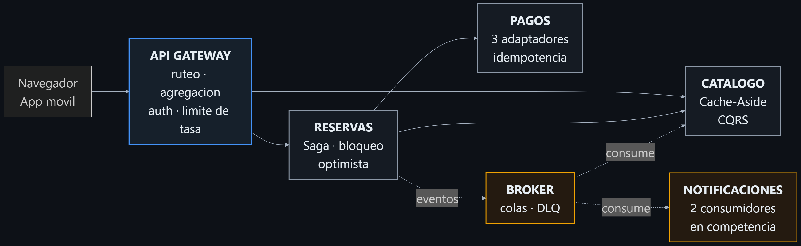
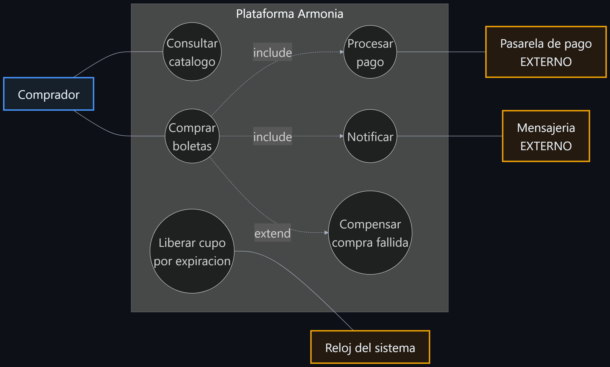
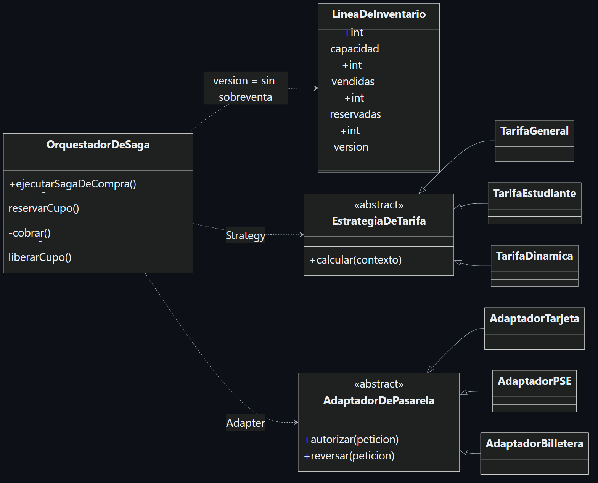
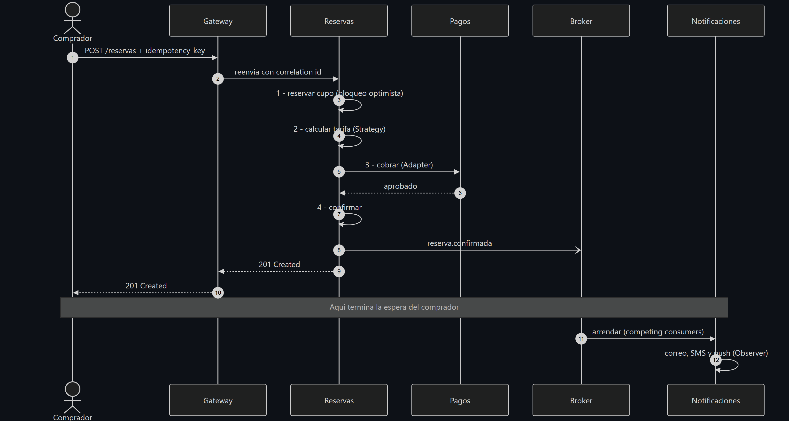
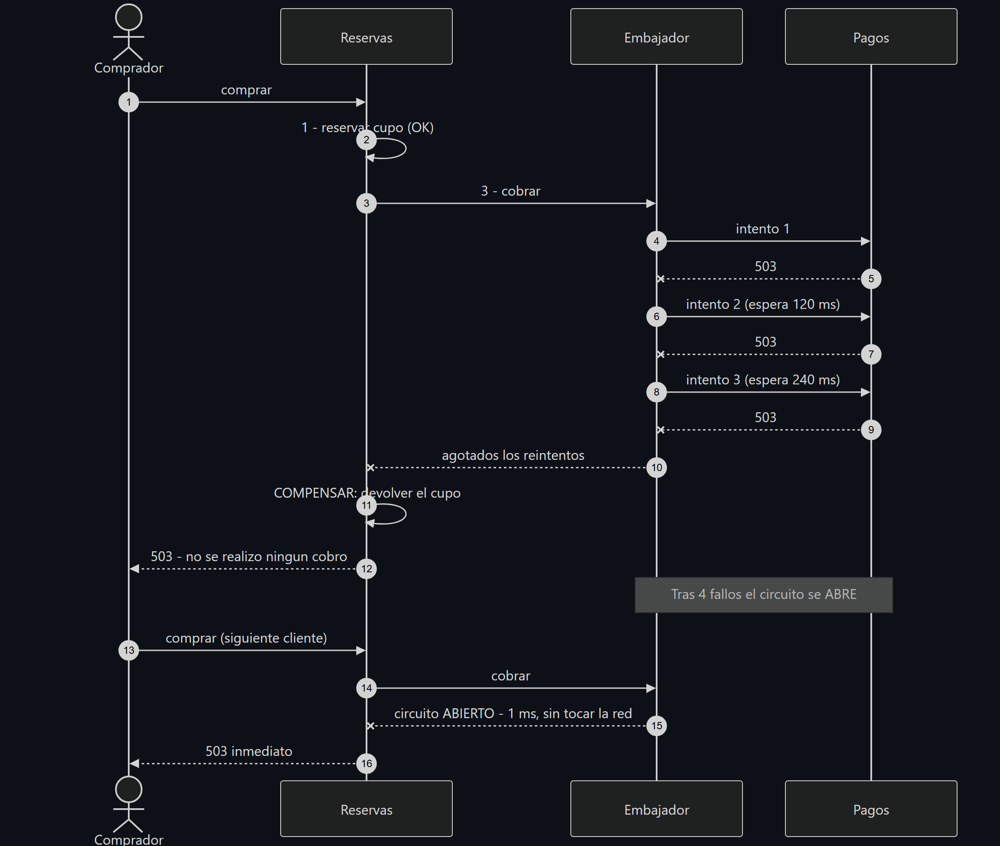
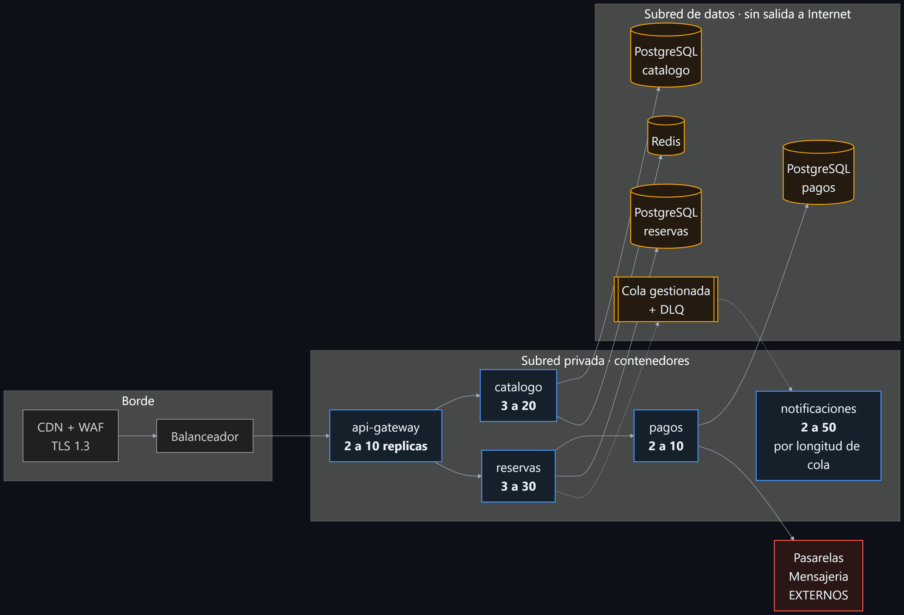

<!-- _class: portada -->

# Orquestando códigos
## La sinfonía de los sistemas

### Arquitectura de microservicios en la nube
### para una plataforma de boletería

<br>

**Juan Esteban Vélez Venegas**
Arquitectura de Software · Unidad 1 · Actividad 2

<br>

`Caso: Armonía S.A.S.`

---

# El problema no es el código

**Armonía S.A.S.** — boletería colombiana. 1,8 millones de boletas en 2025.
Monolito PHP, una base de datos, dos servidores.

| Fecha | Incidente | Impacto |
|---|---|---|
| Mar 2025 | Caída de 47 min en un *onsale* | 1 900 M COP perdidos |
| Jun 2025 | Doble cobro a 3 200 clientes | 340 M COP + sanción |
| Ago 2025 | Sobreventa de 180 boletas | Reubicaciones |
| Nov 2025 | Cae el correo → cae la venta | 6 h sin operar |
| Ene 2026 | Despliegue de reportes tumba la venta | 2 h sin operar |

> Cinco síntomas. **Una sola causa: todo está acoplado a todo.**

---

# Lo que hace único a este negocio

### La demanda no es una curva. Es un pico.

```
usuarios
100 000 ┤        ╭─────────╮
        │        │         │
        │        │         │
    200 ┼────────╯         ╰──────────────────
        └──────────────────────────────────────
           60 s   15–20 min      resto del mes
```

- Del minuto 0 al minuto 1: **de 200 a 100 000 usuarios**
- El resto del mes: prácticamente ocioso
- Presupuesto: **≤ 8 000 USD/mes**, y debe **bajar** fuera del pico

**Escalar el monolito = pagar el pico todo el mes.**

---

# La bisagra del trabajo

### Cada decisión responde a un requisito. Ninguna a una moda.

| Requisito | Decisión arquitectónica |
|---|---|
| RNF-03 · 100 000 usuarios en 60 s | Microservicios + autoescalado independiente |
| RNF-09 · **Sobreventa = 0** | Bloqueo optimista con número de versión |
| RNF-10 · **1 cobro por N reintentos** | Receptor idempotente en 2 niveles |
| RNF-06 · La caída externa degrada, no apaga | Circuit Breaker + Retry + Bulkhead |
| RF-07 · No hay transacción ACID distribuida | Saga orquestada con compensación |
| RNF-01 · Lecturas masivas | Cache-Aside + CQRS |
| RNF-11 · Desplegar sin detener la venta | Base de datos por servicio |

**13 requisitos funcionales · 16 no funcionales · 30 patrones**

---

# Lo que se evaluó y se descartó

| Opción | Por qué no |
|---|---|
| **Monolito modular** | Obliga a replicar *todo* para un pico que afecta al 20 % del código. ×5 el costo |
| **Serverless puro** | Arranque en frío justo en el minuto del *onsale*; ata la saga a un orquestador propietario |
| **Commit en 2 fases** | Bloquea recursos, y **la pasarela externa no implementa el protocolo** |
| **Saga coreografiada** | Nadie puede responder *«¿en qué paso va esta compra?»* |
| **Service Mesh** | Exige equipo de plataforma dedicado (el equipo es de 9 personas) |

> Documentar lo que **no** se usó demuestra que hubo decisión, no acumulación.

---

<!-- _class: diagrama -->

# Arquitectura: vista general



---

<!-- _class: diagrama -->

# Diagrama de casos de uso



**Tres decisiones salen de aquí:** lo que cruza la frontera necesita resiliencia · `extend`
hacia *Compensar* justifica la saga · el **reloj** como actor exige un proceso en segundo plano.

---

<!-- _class: diagrama -->

# Diagrama de clases



`version` en `LineaDeInventario` **no es persistencia: es lo que impide la sobreventa.**
Añadir una pasarela o una tarifa = **una hoja nueva, cero clases modificadas.**

---

<!-- _class: diagrama -->

# Secuencia: la compra funciona



**La espera del comprador termina en el paso 10.** Notificaciones y proyección
ocurren después: el correo no está en el camino crítico.

---

<!-- _class: diagrama -->

# Secuencia: la compra falla



Retry absorbe lo transitorio → el cortacircuitos corta lo persistente →
**la compensación deja el inventario idéntico.**

---

<!-- _class: diagrama -->

# Diagrama de despliegue



Réplicas distintas por servicio · **ninguna flecha** entre un servicio y la BD de otro ·
la subred de datos no ve Internet.

---

# Patrón 1 · Saga orquestada

### El problema
Una compra cambia **dos servicios**. Sin monolito, no hay transacción ACID.

### Por qué no *commit* en dos fases
Bloquea recursos con 100 000 usuarios. Y sobre todo:
**la pasarela externa no implementa el protocolo.**

### Por qué orquestada y no coreografiada
Coreografiada es más desacoplada, pero la lógica queda repartida.
**Para un flujo de dinero, la trazabilidad vale más que el desacople.**

### Lo que cuesta
Ventanas de inconsistencia. Hay que diseñar una compensación por cada paso.

---

<!-- _class: cifra -->

## Con la pasarela caída, el tiempo de respuesta pasó de

# 711 ms → 1 ms

### Esa es la diferencia entre degradarse y caerse.

---

# Patrón 2 · Circuit Breaker (y sus tres compañeros)

```
Mamparo  →  Cortacircuitos  →  Reintento  →  Tiempo límite  →  red
(aísla)     (falla rápido)     (absorbe        (nunca espera
                                transitorios)   indefinidamente)
```

**El orden no es arbitrario:** el tiempo límite se aplica a *cada* intento; el reintento
responde a que uno expiró; el cortacircuitos dice *«ni siquiera lo intentes»*.

### Dos sutilezas que casi nadie implementa

1. **Distingue infraestructura de negocio.** Un `409 sin cupo` significa que el servicio está
   **sano**. Contarlo abriría el circuito sin motivo.
2. **Es por ruta, no por servicio.** Cae la pasarela → se corta la compra,
   **pero la consulta de reservas sigue viva.**

---

# Patrón 3 · Receptor idempotente

### El incidente de junio: 3 200 clientes cobrados dos veces

La petición llega, la respuesta se pierde, el cliente reintenta.
**El problema no es del cliente: el servidor no distingue nueva de repetida.**

| Nivel | Clave | Protege contra |
|---|---|---|
| Cliente → reservas | `idempotency-key` del cliente | El usuario reintentando |
| Reservas → pagos | `cobro-{idReserva}` | **El propio Retry reintentando** |

> El segundo nivel es el que se olvida:
> **el patrón Retry es en sí mismo una fuente de duplicados.**

```
1er envío → HTTP 201, reserva RES-C37E67BD
2do envío → HTTP 200, reserva RES-C37E67BD   ← la misma. Un solo cobro.
```

---

# Patrón 4 · Bloqueo optimista

### El incidente de agosto: 180 boletas sobrevendidas

Dos compradores leen «quedan 5», ambos restan, ambos guardan 4.
**Actualización perdida.** Con 20 000 personas, miles de veces por minuto.

**No bloqueo pesimista:** serializaría a todos sobre la misma fila →
cambia un problema de corrección por uno de disponibilidad.

### Resultado medido

```
20 compradores simultáneos · 4 boletas disponibles
→ 4 exitosas · 16 rechazadas con 409 · SOBREVENTA: 0
```

**1 044 conflictos resueltos** durante la prueba de carga. Cero inconsistencias.

---

# El hallazgo más valioso fue un fracaso

### Primera implementación: espera exponencial para los conflictos

| Configuración | Tasa de error |
|---|---|
| 5 intentos, espera exponencial | 30 % |
| 12 intentos, espera exponencial | **92 %** 😱 |
| 12 intentos, **espera corta aleatoria** | **< 5 %** |

**Subir los reintentos empeoró el resultado.** Las esperas superaban el *timeout* del gateway.

> **Un conflicto de concurrencia no es una caída.**
> No hay nada recuperándose que necesite tiempo: se resuelve en microsegundos.
> El backoff exponencial es correcto para la red y **contraproducente** para bloqueos.

**Un patrón mal aplicado es peor que ningún patrón. Solo la medición lo reveló.**

---

# Patrón 5 · Cache-Aside + CQRS

### Por cada compra hay entre 50 y 200 consultas

- **Cache-Aside** con invalidación por evento → **212 ms → 2 ms (−99 %)**
- **CQRS**: el catálogo mantiene su propia vista de disponibilidad, actualizada
  **consumiendo eventos**, no consultando a reservas

### La decisión difícil: consistencia eventual

Mostrar «quedan 43» cuando quedan 41 **no daña a nadie**.
La venta la valida siempre el almacén autoritativo.

> **Consistencia fuerte donde el negocio no admite error.
> Consistencia eventual donde la exactitud no se justifica.**

### El detalle que se olvida: la estampida de caché
25 peticiones simultáneas sobre una clave vacía → **1 sola lectura al origen**

---

# Demostración en vivo

### Panel de control · `http://localhost:8080`

1. **Cache-Aside** — recargar dos veces: `base-de-datos` → `cache`
2. **Agregación BFF** — una llamada, tres servicios
3. **Compra** — la saga con sus 4 pasos
4. **Idempotencia** — reenviar la misma clave
5. **Tumbar pagos** 💥 — compensación + cortacircuitos en vivo
6. **Recuperación automática** — sin reiniciar nada

---

# Resultados medidos

| Escenario | rps | p50 | p95 | Error |
|---|---:|---:|---:|---:|
| Catálogo (cacheado) | 3 739 | 5 ms | 8 ms | 0 % |
| Agregación BFF | 1 794 | 11 ms | 14 ms | 0 % |
| Compra completa (saga) | 26 | 408 ms | 800 ms | 4,5 % |
| Compra con 30 % de fallos | 25 | 441 ms | 850 ms | 3,3 % |

| | |
|---|---|
| **41 / 41** pruebas automatizadas | 24 unitarias + 17 de integración real |
| **9 / 11** RNF verificables cumplidos | Los 2 restantes: declarados como no verificables |
| **0** boletas sobrevendidas | En todos los escenarios |
| **99,9 %** de aciertos de caché | Bajo carga sostenida |

---

# Lo que NO funciona (y hay que decirlo)

| Limitación | Por qué está ahí | Cómo se resuelve |
|---|---|---|
| Persistencia en memoria | Es un prototipo académico | PostgreSQL por servicio |
| Broker propio | Sin dependencias, por reproducibilidad | SQS / Service Bus |
| Clave de API estática | Fuera del alcance | OAuth 2.0 / OIDC |
| Contención > 50 escritores | Límite del bloqueo optimista | Particionar el inventario |
| Gateway con una instancia | Punto único de fallo | 2 réplicas en zonas distintas |

### Dos requisitos NO se verificaron
**RNF-03** (100 000 usuarios) y **RNF-05** (99,9 %) exigen carga distribuida y operación real.
**Afirmar que se cumplen con esta evidencia sería incorrecto.**

---

# Conclusiones

**1.** La arquitectura se justifica por **atributos de calidad**, no por tecnología.

**2.** En sistemas distribuidos **el fallo es el caso normal**, no la excepción.
   711 ms → 1 ms es la justificación completa del cortacircuitos.

**3.** La consistencia es **una decisión de diseño**, no un absoluto.
   Fuerte en el inventario. Eventual en la disponibilidad mostrada.

**4.** Los patrones son **vocabulario, no recetas**. Lo que importa es saber cuál,
   por qué, y **qué se paga por él**.

**5.** Un patrón mal aplicado **es peor que ningún patrón** (30 % → 92 % de error).

**6.** La modularidad **se paga con complejidad operativa**. Para una demanda estable,
   el monolito modular habría sido la respuesta correcta.

---

<!-- _class: portada -->

# Gracias

### ¿Preguntas?

<br>

**Repositorio:** https://github.com/ingjvelez17/armonia-arquitectura
**Prototipo desplegado:** https://armonia-gateway.onrender.com

<br>

Juan Esteban Vélez Venegas
Arquitectura de Software · Unidad 1
